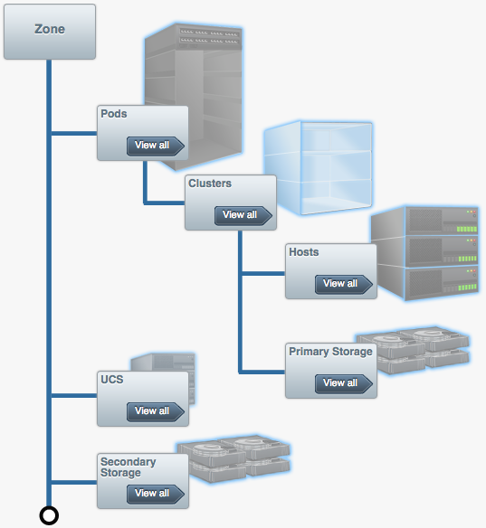
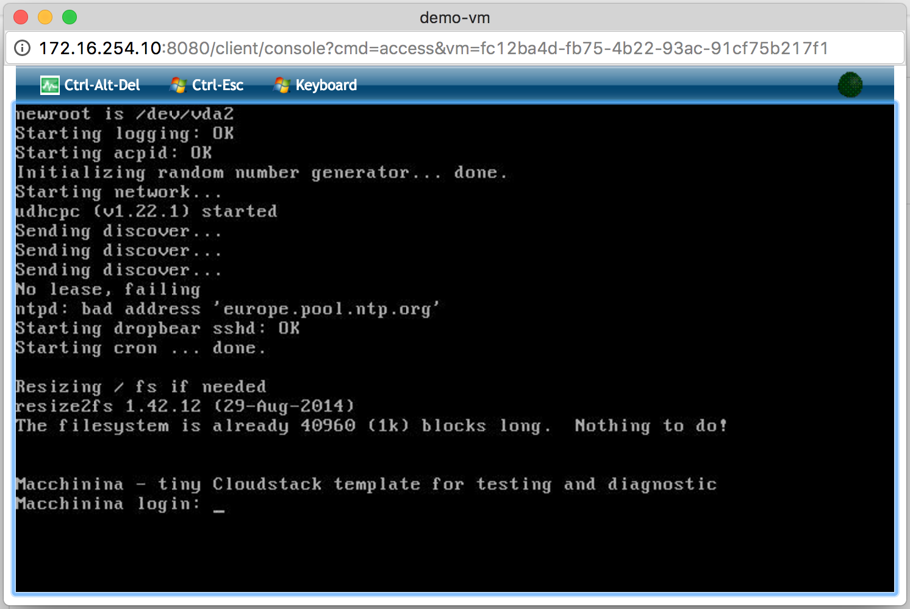

# Cloud: Zero to Sixty

## Deploy a cloud in 40 mins

**Will Stevens&nbsp;&nbsp;&nbsp;&nbsp;@swillops**  

VP @ Apache CloudStack  
Lead Developer @ CloudOps  

[`github.com/swill/apachecon2016`](https://github.com/swill/apachecon2016)

---

## On The Menu

We will be configuring an Apache CloudStack (ACS) cloud on my laptop using VMware Fusion.  

---

## Upstream Networking

The ACS environment will be connected to my Mac's network through a VyOS router.

`./vyos/01_configure.sh`

___

## VyOS Duties

- The network uplink for the entire environment.
- Gateway for both Management and Public networks.
- Edge firewall.  In this case just a pass through.
- Firewall to protect the Management network.

___

## VyOS VM Resources

Small VM since we don't expect much load.

___

## Internet NIC (eth0)

___

## ACS Public NIC (eth1)

___

## ACS Management NIC (eth2)

---

## ACS Management VM

ACS Management node, MySQL and NFS mounts.

`./acs/01_network_config.sh`
`./acs/02_install_acs.sh`

___

## ACS Management Duties

- Management interface for both Web and API.
- Orchestrates all the host compute resources.
- Orchestrates the Public and Guest networks.
- Orchestrates VM storage (Root and Data).
- Our Case: MySQL database for ACS.
- Our Case: NFS mounts for storage.

___

## ACS Management VM Resources

Restricted by the size of my laptop obviously.

___

## ACS Management NIC (eth0)

---

## KVM Hypervisor VM

KVM Hypervisor Host for ACS to orchestrate.

`./kvm/01_network_config.sh`
`./kvm/02_install_kvm.sh`

___

## KVM Duties

- Provide compute resources to be orchestrated.
- Hosts the System VMs (more on this later).
- Guest network isolation and hosts the VRs.
- Implements the snapshotting functionality.
- Implements the VM recovery point feature.

___

## KVM Host VM Resources

Again, very limited due to the size of my Mac.

___

## ACS Management NIC (eth0 / cloudbr0)

___

## ACS Public NIC (eth1 / cloudbr1)

___

## ACS Guest NIC (eth2 / cloudbr2)

---

## Deploy Datacenter

ACS and KVM are both ready to go now.

- Setup Zone, Pod, Cluster and KVM Host.
- Configure the orchestrated network ranges.
- Start System VMs (SSVM + Console)

`./acs/03_configure_zone.sh`

___

___

## Functional Groupings

- Region: A grouping of Zones.
- Zone: Usually a data center.
	- Secondary Storage, Guest & Public IP Ranges
- Pod: Usually a rack and can have multiple Clusters.
	- Management Network, Cluster connectivity
- Cluster: A group of hosts of the same hypervisor.
- Host: The actual hypervisor host being orchestrated.
	- VMware, XenServer, HyperV, KVM

___

## Secondary Storage VM

Handles everything related to templates and snapshots.

- Transfer snapshots from Primary to Secondary storage.
- Converting snapshots to templates to launch VMs.
- Uploading and exposing templates to launch VMs.

___

## Console Proxy VM

Exposes VM consoles through a web UI.

---

## Architecture Review

---

## ACS & KVM

ACS orchestrates the resources on the KVM Host.

___

## Moving Pieces

- ACS Mgmt is exposing an NFS mount for Primary Storage.
- ACS Mgmt is exposing an NFS mount for Secondary Storage.
- KVM is hosting a Console Proxy VM to expose VM consoles.
- KVM is hosting the Secondary Storage VM for managing snapshots and templates.
