# Cloud: Zero to Sixty

### Deploy your own cloud

Will Stevens  
VP @ Apache CloudStack  
Lead Developer @ CloudOps  

Follow Along: `github.com/swill/apachecon2016`

---

## Straight into the weeds

We will be configuring an Apache CloudStack (ACS) cloud on my laptop using VMware Fusion.  

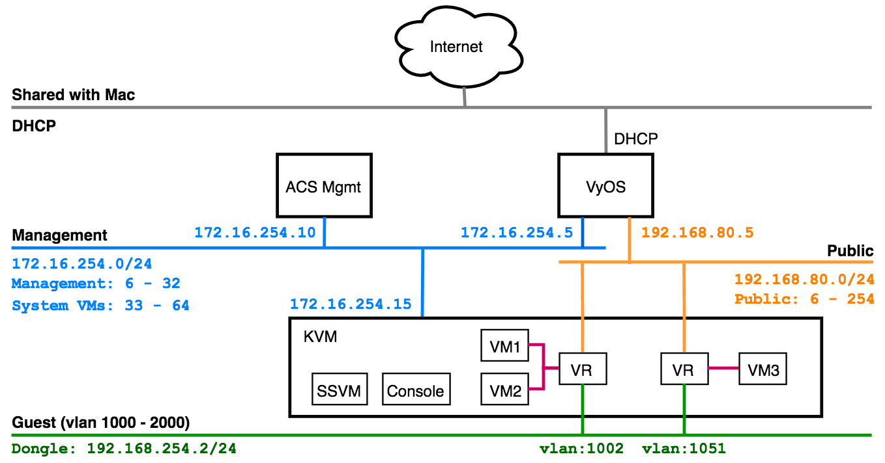

---

## Upstream Networking

The ACS environment will be connected to my Mac's network through a VyOS router.

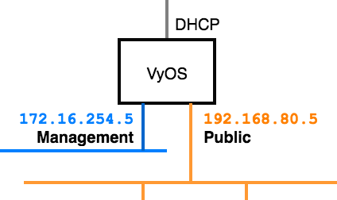

`./vyos/01_configure.sh`

___

## VyOS VM Resources

Small VM since we don't expect much load.

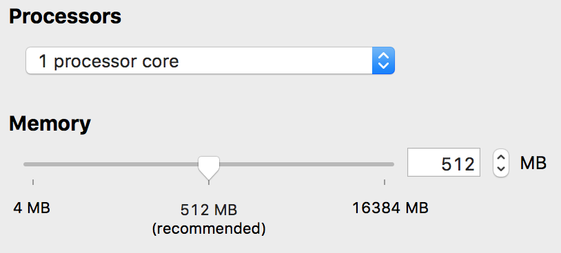

___

## Internet NIC (eth0)

___

## ACS Public NIC (eth1)

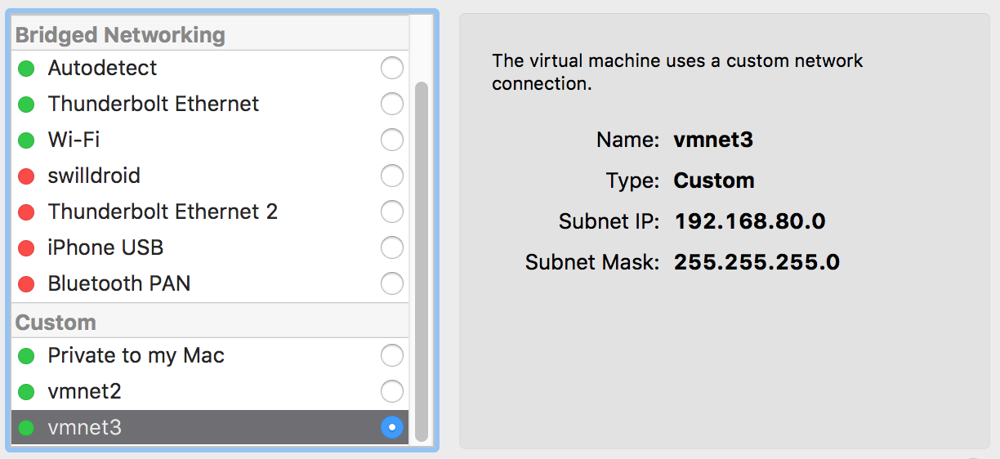

___

## ACS Management NIC (eth2)

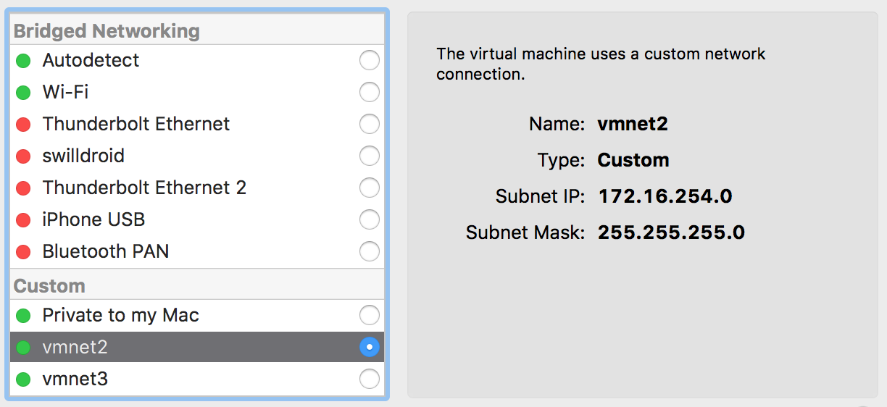

---

## ACS Management VM

ACS Management node.  
ACS MySQL database node.  
NFS for Primary and Secondary storage.  

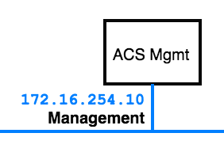

`./acs/01_network_config.sh`
`./acs/02_install_acs.sh`

___

## ACS Management VM Resources

Restricted by the size of my laptop obviously.

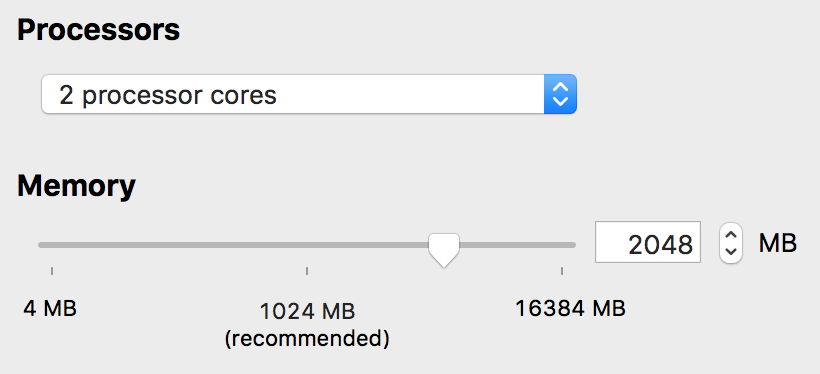

___

## ACS Management NIC (eth0)

---

## KVM Hypervisor VM

KVM Hypervisor Host for ACS to orchestrate.

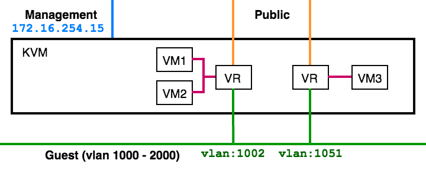

`./kvm/01_network_config.sh`
`./kvm/02_install_kvm.sh`

___

## KVM Host VM Resources

Again, very limited due to the size of my Mac.

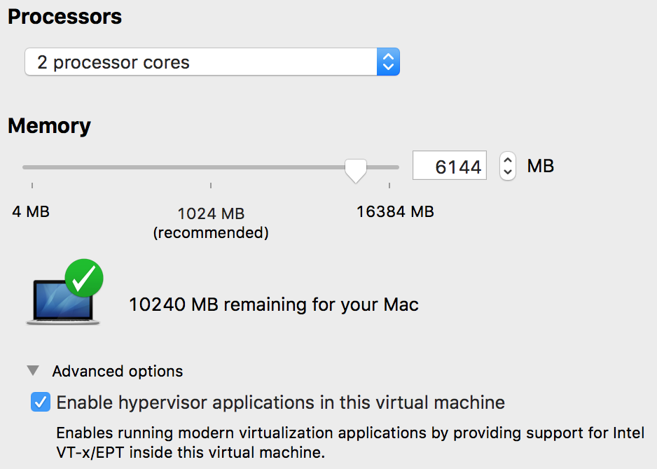

___

## ACS Management NIC (eth0 / cloudbr0)

___

## ACS Public NIC (eth1 / cloudbr1)

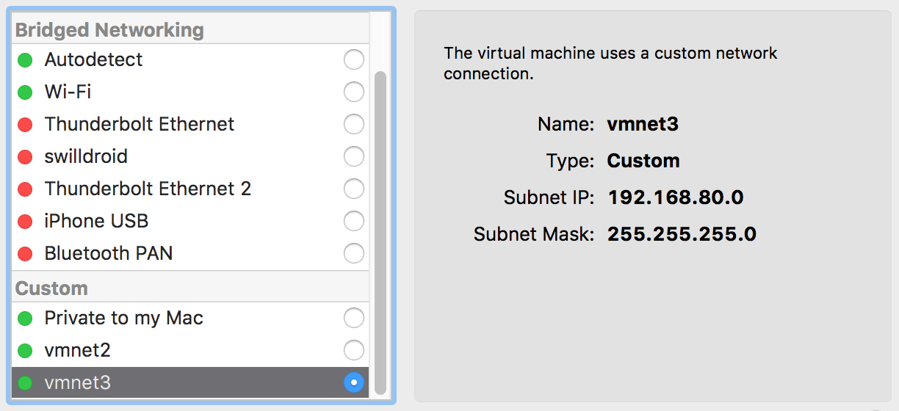

___

## ACS Guest NIC (eth2 / cloudbr2)

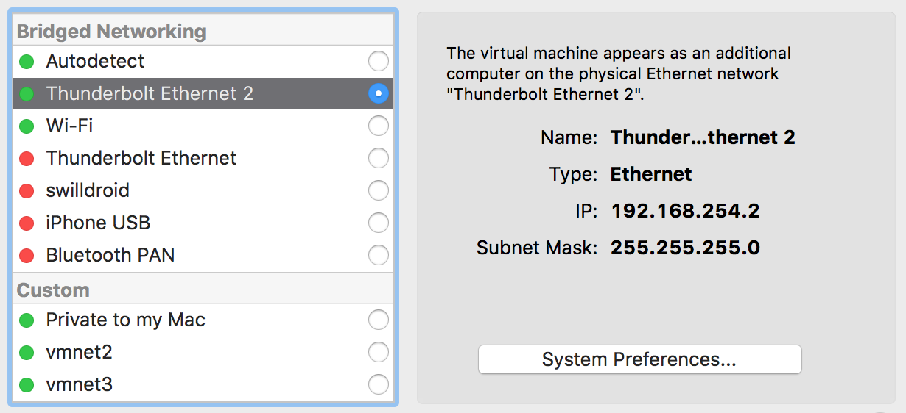

---

## ACS & KVM

ACS orchestrates the resources on the KVM Host.

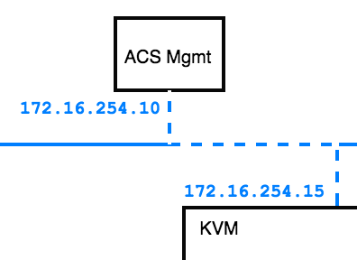

ACS Mgmt mimics a SAN for Primary and Secondary storage.

---

## Deploy Datacenter

ACS and KVM are both ready to go now.

- Setup Zone, Pod, Cluster and KVM Host.
- Configure the orchestrated network ranges.
- Start System VMs (SSVM + Console)

`./acs/03_configure_zone.sh`

---

## Lets Review

